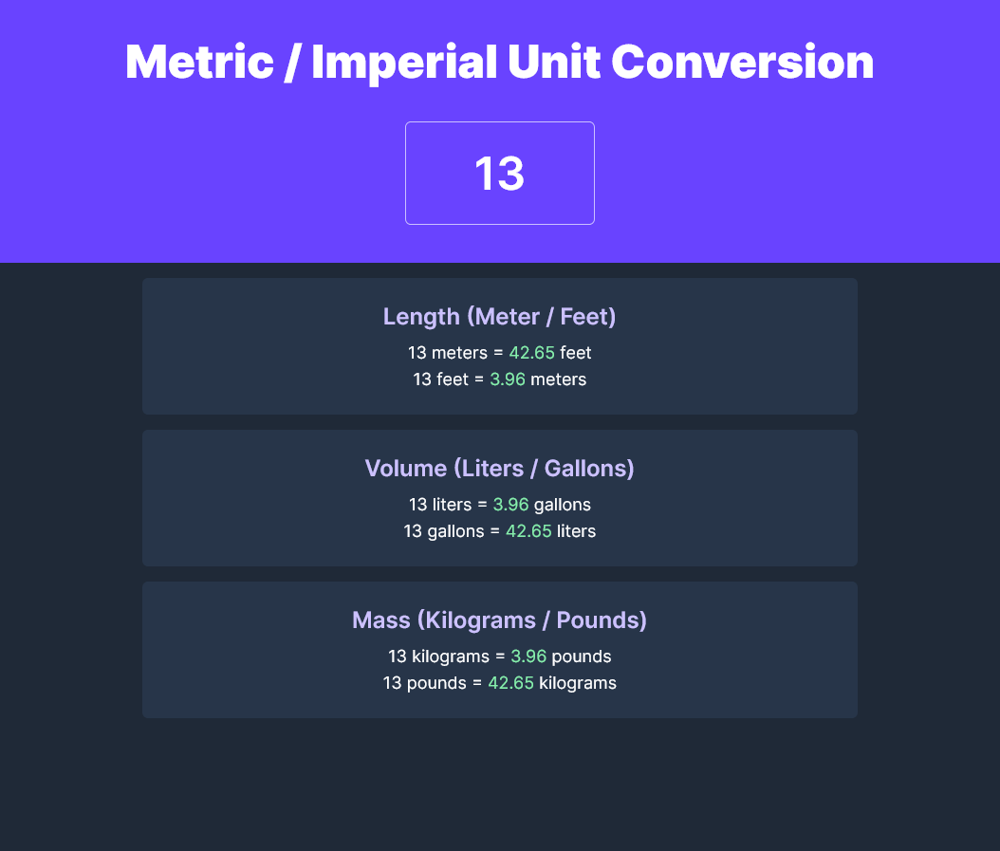

# Unit converter remake

Basic unit conversion app (remake of [this](https://github.com/FelixHPerez/unit-converter) repo). This new repo uses vite and react instead of direct Javascript DOM manipulation.

## Live demo

[Netlify](https://flx-unit-converter.netlify.app/)

## Screenshots

## Built with

- Vite
- React
- Tailwind
